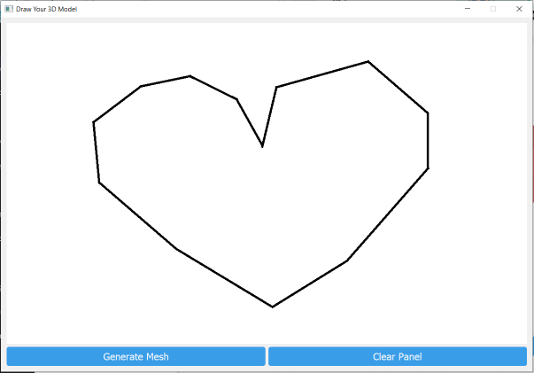
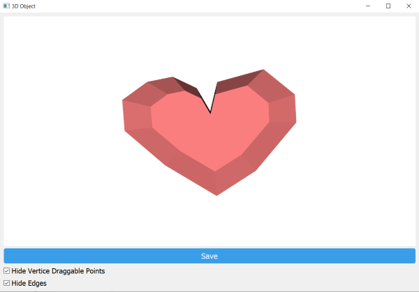

# Sketch-Based 3D Modeling Software

This repository contains the source code for a Python-based sketch-based interactive 3D modeling software, inspired by the FiberMesh concept and designed to simplify the creation of 3D models from 2D sketches. It's targeted at new users, aiming to reduce the learning curve and make 3D modeling more accessible.

## Features

- **Sketch to 3D**: Convert sketches directly into 3D models.
- **Interactive GUI**: Simple, user-friendly graphical interface for model manipulation.
- **Export Capabilities**: Export your models in .obj format, ready for use in other 3D applications.

## Getting Started

### Prerequisites

Ensure you have Python installed on your system. 

### Installation

Clone this repository:

```bash
git clone https://github.com/Mandy-NM/Sketch-Based-3D-Modelling.git
cd Sketch-Based-3D-Modelling
```

Install the required Python libraries:

```bash
pip install -r requirements.txt
```

### Run The Program

Run the program with:

```bash
python sketch_3D_modelling.py
```

## Sample Result
<p align="center">
  
  
</p>